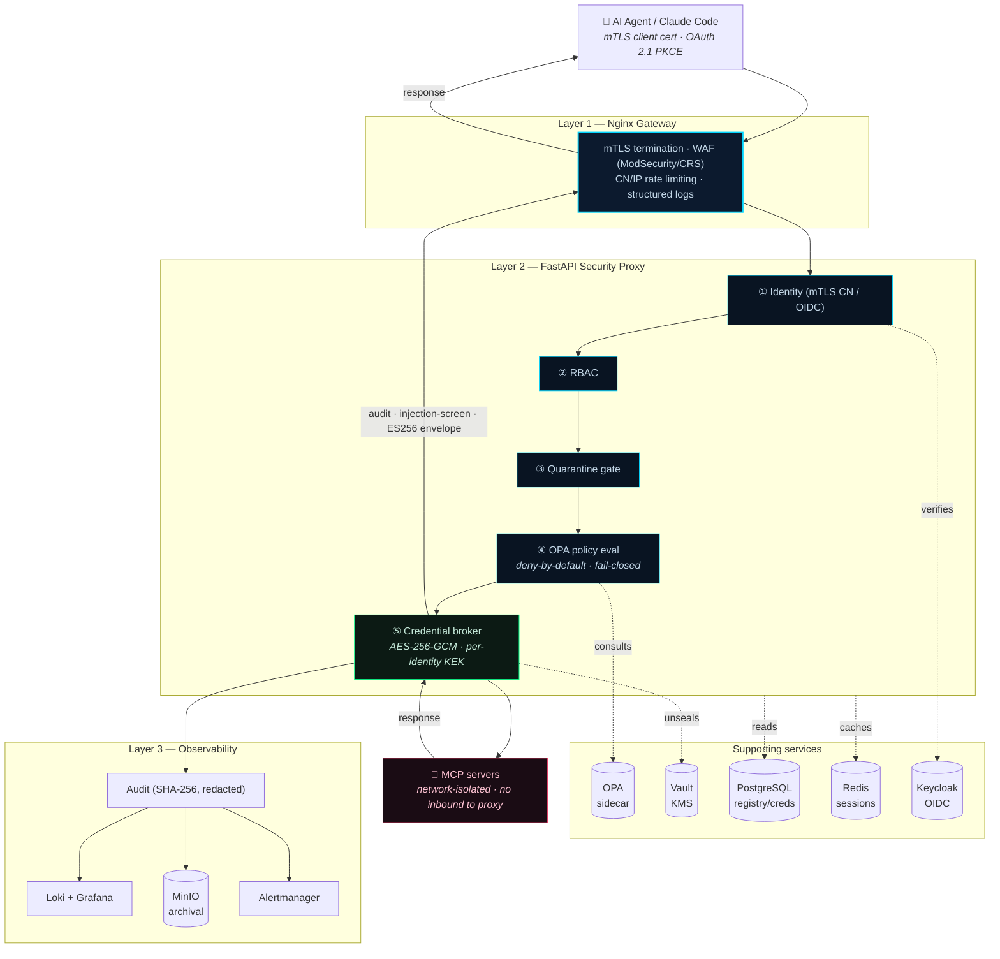
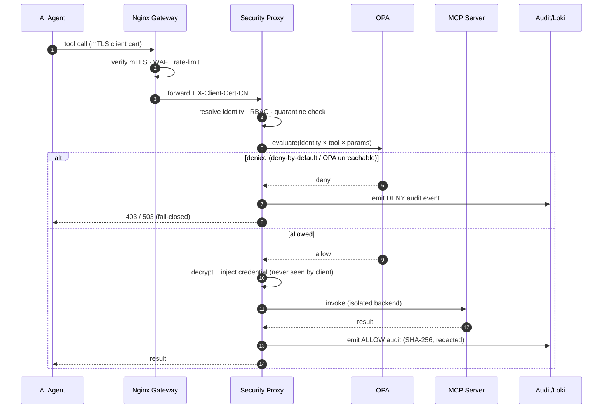

# MCP Security Platform

### Mediate, don't classify — a runtime security gateway for AI-agent tool calls.

> Every [Model Context Protocol](https://modelcontextprotocol.io/) (MCP) tool call passes through identity, policy, credential brokering, and audit — with backend MCP servers network-isolated by default.

[](https://github.com/webr0ck/mcp-security-platform/actions/workflows/ci.yml)
[](LICENSE)
[](#enforced-today-vs-roadmap)
[](https://www.python.org/)
[](https://www.openpolicyagent.org/)

An **open-source reference implementation (work in progress)** exploring how to secure MCP tool
calls at runtime — by *mediating* every call through identity, policy, and audit rather than
trying to statically classify MCP servers as safe.

> **Engineering standard.** This is a reference implementation, not a hardened product — and it's
> held to a rule most security tooling isn't: **every claim is matched to code, and every gap is
> tracked in the open.** The **[Enforced today vs Roadmap](#enforced-today-vs-roadmap)** table is the
> source of truth — if a control isn't in the "Enforced today" column, it's roadmap, stated plainly
> rather than glossed. An honest threat model is more useful than an over-claimed one. See
> [`SECURITY.md`](SECURITY.md) for tracked known-limitations and the disclosure policy.

**Contents:** [Thesis](#the-thesis) · [What makes this interesting](#what-makes-this-interesting) · [Architecture](#architecture) · [Enforced vs Roadmap](#enforced-today-vs-roadmap) · [Getting started](#getting-started) · [Connecting Claude Code](#connecting-claude-code-to-this-proxy) · [Docs](#documentation)

---

## The thesis

You can't reliably decide *in advance* whether an MCP server is safe. Static scanning misses
**semantic capability** — a server that wraps a C2 framework, or quietly exfiltrates through a
"search" tool, looks benign until it calls home. So instead of classifying servers, this platform
**mediates every tool call** at runtime through identity → policy → audit, and keeps the backend
servers network-isolated by default.

It is aimed at **platform and security engineers** who need to let LLM agents use MCP tools
without handing those tools the keys to the environment.

**Threat model in one paragraph:** the adversary is a *malicious or compromised MCP server* (or a
prompt-injected agent driving it) that wants credentials, data exfiltration, or lateral movement.
This platform's job is to ensure that even a fully hostile backend never sees a raw credential,
can't be invoked outside policy, can't reach the proxy or other backends over the network, and
can't act without a hash-chained, redaction-safe audit trail (HMAC-signed in production).

## What makes this interesting

- **A thesis, not a feature list.** Most MCP security tooling tries to *classify* servers as
  safe/unsafe. This argues that's unwinnable, and builds the alternative: runtime mediation of
  every tool call.
- **Zero-credential MCP clients.** Claude Code connects with *no API keys in config* — OAuth 2.1
  PKCE end to end; the proxy injects backend credentials the client never sees.
- **Fail-closed everywhere, gated in CI.** Deny-by-default OPA, signed policy bundles by default,
  and a security-invariant suite (`make security-check`) that fails the build on a fail-open regression.
- **Network isolation you can verify in one command** — `python scripts/check_network_isolation.py`
  statically verifies the compose topology keeps backend MCP servers off the proxy's network
  (a membership check, daemon-free); regression-gated across every tier in `make security-check`.
  Runtime unreachability is proven separately by the red-team harness.
- **Adversarial test suite** — a containerized red-team harness (`sandbox/tests/red_team/`) probes
  credential exfil, network/filesystem isolation, privilege escalation, seccomp, and tool poisoning.
- **Docs matched to code, gaps tracked openly** — the Enforced-vs-Roadmap table is the source of
  truth; over-claiming is treated as a bug.

## Architecture

Three enforcement layers in front of network-isolated backends:



### Request flow for a single tool call



### Layers

- **Layer 1 — Nginx gateway:** TLS termination, mTLS client-cert enforcement, ModSecurity/OWASP-CRS WAF, structured logs, CN/IP rate limiting.
- **Layer 2 — FastAPI security proxy:** identity resolution, OPA/Rego policy evaluation, LLM-assisted tool-manifest auditing (Ollama, advisory), CycloneDX SBOM per tool, sliding-window anomaly heuristics, fail-closed credential injection, synchronous audit emission.
- **Layer 3 — Observability:** audit logger (SHA-256, redaction), Loki + Grafana, Alertmanager, MinIO archival, daily compliance checks.

---

## Enforced today vs Roadmap

| Area | Enforced today (verified in code) | Roadmap / not yet wired |
|---|---|---|
| **Policy (OPA/Rego)** | OPA-evaluated + audited on **both** the REST path (`/api/v1/tools/{id}/invoke`) and the `/mcp` invoke path (both call `services/invocation.py`); built-in `/mcp` **meta-tools now evaluate OPA under the real caller identity** (role-based `platform_meta_tool_roles` in `authz.rego` — no longer a placeholder `platform_admin`); **discovery==invoke now enforced on invoke** for server-linked tools (`enforce_tool_entitlement` in `invoke_tool` — no role exception, admin included); **signed OPA bundles are the DEFAULT** (`docker-compose.yml` runs `--verification-key` + `bundle.tar.gz:ro`; `make up` auto-signs; `make security-check` gates via `scripts/check_signed_default.sh`) | tools not yet linked to a `server_id` are governed by OPA only, not by per-server entitlement |
| **Identity** | Gateway terminates mTLS and sets client identity; the proxy honours the `X-Client-Cert-CN` header **only** when the request carries the matching `X-Gateway-Secret` Nginx injects (`_is_trusted_proxy`, `hmac.compare_digest`, **fail-closed**) and **production refuses to start without `GATEWAY_SHARED_SECRET`** (F-001 mitigated); server-side nonce + PKCE on credential enrollment; the production gateway routes `/mcp`, `/.well-known/*`, and `/oauth/register` | External Keycloak access-token Bearer is accepted as a fallback (see OIDC-login row); the gateway-secret check holds only while backends stay network-isolated so non-gateway containers never receive the secret — enforced by the isolation gate below |
| **OIDC login** | **Keycloak browser login, PKCE S256, session JWT, Grafana SSO** — full flow (`/api/v1/auth/oidc/*`); KC tokens stored server-side only; HttpOnly session cookie; **session JTI revocation IS enforced on every request**; external Bearer path validates **`iss`** and (in production) **`aud`** | External Keycloak access token as Bearer is accepted as a fallback; in dev/lab `aud` validation is off when `OIDC_AUDIENCE` is unset (production startup is blocked unless it is set) |
| **Credential broker** | **Wired into the request path at startup**; **fail-closed** at call time when `VAULT_TOKEN` is empty. Crypto hardened — HKDF-SHA256 KEK, AES-256-GCM + AAD row-binding, Vault HTTPS-only (prod), PKCE, synchronous enrollment audit | Approach-B service adapters (`gitea/grafana/netbox`) are orphaned (live path uses approach-A `credential_store` crypto) |
| **Credential injection modes** | `injection_mode` on `tool_registry`; **`service` / `user` active and fail-closed**; `service_account` (KC client-credentials) active; **`oauth_user_token` (RFC 8693) functional for direct-OIDC callers**; **`entra_client_credentials` reads secret from Vault-backed `credential_store`**; admin credentials UI to upload/rotate/revoke | `oauth_user_token` for internal-session (browser portal) callers still fails closed; **`passthrough`** / **`entra_user_token`** wired in code but not settable via the admin API; **`basic_auth`** is a storable credential type but has no injection-mode handler — selecting it fails closed |
| **Server registry** | **`server_registry` is the single source of truth**; `registry.py` reads DB, 30s auto-refresh; **self-service onboarding via `POST /api/v1/servers`** (server_owner role); consent dual-control; adapter healthcheck at approval; **tool discovery + quarantine** on registration; server-scoped OAuth enrollment | Server-owner onboarding wizard UI |
| **OPA grants sync** | **Grants are DB-authoritative**; `client_grants` pushed to OPA via data API on every mutation (fail-closed — 503 if push fails); 60s reconcile loop; startup push on proxy boot (RBAC `role_assignments` is a separate table consumed by middleware, not pushed to OPA) | OPA brief deny window (~1 reconcile interval) after OPA restart before first push completes |
| **Client grants** | **ENFORCED** — `client_grants` table, `admin_grants` router, OPA data-API push on every mutation; `data.mcp_grants` evaluates per-tool allow lists at invocation time | Grants are per-tool-name; server-scoped grants are roadmap |
| **Network isolation** | **F-001 isolation proven by a static compose-topology gate across all five tiers** (`docker-compose.yml`, lab, POC, `engine`, `standard`) — MCP/sidecar services share no network with the proxy, so a non-dialed sidecar has no route to `proxy:8000` (pairwise networks, egress proxy); regression-gated in `make security-check` | The static gate proves topology *membership*; **runtime** reachability is now asserted in the **CI smoke job** (a container on `internal-net` must fail to reach `proxy:8000`), with the fuller red-team harness (`sandbox/tests/red_team/`) run on-demand for deeper cases |
| **Audit / observability** | Synchronous audit on REST + `/mcp` invocation + credential enrollment; SHA-256 per-event; raw tool args never persisted (hashes only); Loki/Grafana; **`/mcp` meta-tool audit is fail-closed** | Quarantine/error audit paths on non-meta-tool routes remain synchronous-emit-or-500; MinIO uses GOVERNANCE retention (not tamper-proof WORM); compliance checker is advisory |
| **Trust envelope (POC)** | **ES256-signed envelopes on every tool result** (JCS/RFC 8785 canonicalization); **passive inline verifier** (logs verdict, never blocks); taint floor + session tracking | Cross-trust federation deferred; learned trust-tier classifier is roadmap |
| **Gateway** | mTLS, structured logs, rate limiting by client-CN / source-IP | per-tool rate limiting not built; production tier does not expose the MCP/OAuth endpoints (see Identity row) |
| **SBOM** | CycloneDX per tool | SPDX **not implemented** |
| **Anomaly detection** | Per-call static **advisory heuristic** (keyword/tool-name rules) feeds an OPA input score — honestly labelled as a heuristic, not a learned model | Learned/statistical per-client baseline = roadmap (the heuristic is trivially evaded by renaming a tool — do not rely on it as a behavioural model) |
| **Not built** | — | Helm/K8s (template stubs) · admin-UI IDP configuration · outbound Jira (inbound webhook only) · learned anomaly baseline |

The remaining gaps above are *coverage / wiring* gaps, tracked honestly rather than papered over.

---

## Getting started

There are two ways to run this, and they use **different container engines on purpose**:

| You want to… | Use | Engine | Guide |
|---|---|---|---|
| Run a production-shaped service and **bring your own** IDP / SIEM / log collectors / MCP servers | `engine` tier | **Docker** Compose v2.20+ | **[INSTALL.md](INSTALL.md)** |
| Spin up the **full self-contained lab** (bundled Keycloak, Dex, Wazuh, sample MCP servers) for testing | lab stack | **Podman** | **[LAB.md](LAB.md)** |

Minimal taste of the lab (requires **Podman 4.4+** and a ~6 GB Podman VM — see [LAB.md](LAB.md)
for prerequisites and the required `OIDC_ISSUER_URL` step before first run):

```bash
git clone https://github.com/webr0ck/mcp-security-platform
cd mcp-security-platform
cp .env.lab.example .env.lab     # then set OIDC_ISSUER_URL (see LAB.md)
make -f Makefile.lab lab-up      # build + start + seed
make -f Makefile.lab lab-smoke   # expect all checks green
```

A reproducible demo of the verified **network-isolation** control:
`python scripts/check_network_isolation.py`.

### Development

> Requires a running stack first (see [CONTRIBUTING.md](CONTRIBUTING.md) / [LAB.md](LAB.md)):
> bring the lab up with `make -f Makefile.lab lab-up`, then:

```bash
make dev-up         # hot reload + debug ports
make test           # tests
make lint
make security-check # CI security-invariant gate (secret scan + rego lint + OPA deny-default + F-001 isolation)
make ship-check     # docs-honesty gate + secret scan + compose smoke + isolation demo (pre-publish)
```

---

## Connecting Claude Code to this proxy

Auth for **human users is OAuth 2.1 PKCE via Keycloak** — not static API keys.

### Step 1 — Set `PROXY_BASE_URL` in `.env` / `.env.lab`

```bash
PROXY_BASE_URL=http://<YOUR_LAN_IP>:8000   # your machine's LAN or Tailscale IP
```

This is required. Without it, OAuth discovery URLs fall back to `request.base_url` (the Host
header), which may return `localhost` and break the flow for remote clients. Restart the proxy
after changing it: `make dev-down && make dev-up`.

### Step 2 — Add the MCP server to Claude Code on the client machine

In `~/.claude/settings.json` (or `~/.claude.json`) on the machine running Claude Code:

```json
{
  "mcpServers": {
    "mcp-gateway": {
      "type": "http",
      "url": "http://<YOUR_LAN_IP>:8000/mcp"
    }
  }
}
```

**Two critical points:**
- Use `"type": "http"` — not `"sse"`. `"http"` is Claude Code's string for Streamable HTTP transport; `"sse"` skips the OAuth flow and reports `-32000`.
- Use `"url"` — not `"command"`. `"command"` is for `stdio` (subprocess) transport only.

### What happens on first connection

1. Claude Code → `GET /mcp` → 401 with `WWW-Authenticate: Bearer resource_metadata="…/.well-known/oauth-protected-resource"`
2. Claude Code → discovers the authorization server and Keycloak endpoints via the `.well-known` documents
3. Claude Code → `POST /oauth/register` → receives a public `client_id` (no secret)
4. Claude Code opens your browser → Keycloak login
5. After login, Claude Code uses the Keycloak access token as `Authorization: Bearer <token>` on subsequent requests

**No credentials go in the config file** — the OAuth PKCE flow handles it.

### Troubleshooting

| Symptom | Cause | Fix |
|---|---|---|
| `-32000` / no browser opens | Wrong transport type (`"sse"`) | Use `"type": "http"` |
| `-32000` / no browser opens | `PROXY_BASE_URL` not set | Set it and restart the proxy |
| Browser opens, login fails | Keycloak not reachable | Ensure the Keycloak port is reachable from the client |
| 401 after login | User has no role assigned | `make assign-role CLIENT_ID=<email> ROLE=agent` |
| 429 on registration | Redis error (rate-limit fails closed) | Check Redis: `make logs SVC=redis` |

---

## Technology stack

| Component | Technology |
|---|---|
| Gateway | Nginx + ModSecurity (OWASP CRS) |
| Internal CA | Smallstep step-ca |
| Proxy | Python 3.12, FastAPI, Pydantic v2 |
| Policy engine | OPA (sidecar) |
| Local LLM | Ollama (advisory risk scoring) |
| Database | PostgreSQL 16 |
| Cache / sessions | Redis 7 |
| Identity provider | Keycloak 24 (primary, PKCE S256, Grafana SSO) · Dex (mock/secondary, lab) |
| Secrets / KMS | HashiCorp Vault |
| SBOM | CycloneDX |
| Logs | Loki + Promtail · Grafana · Alertmanager · MinIO archival |

## Documentation

| Doc | Purpose |
|---|---|
| [`INSTALL.md`](INSTALL.md) | Production deployment (bring-your-own IDP / SIEM / logs / MCP servers) |
| [`LAB.md`](LAB.md) | Full self-contained lab for testing |
| [`docs/ARCHITECTURE.md`](docs/ARCHITECTURE.md) | Canonical, reusable architecture spec — enough to re-implement from scratch, incl. the security invariants (§10). The Enforced-vs-Roadmap table above is authoritative for per-control status. |
| [`docs/TESTING.md`](docs/TESTING.md) | How to run the suite and the security gate |
| [`SECURITY.md`](SECURITY.md) | Responsible disclosure + tracked known-limitations |
| [`CONTRIBUTING.md`](CONTRIBUTING.md) | How to contribute |
| [`AGENTS.md`](AGENTS.md) | Repo map & conventions for contributors |

## License

[MIT](LICENSE) © 2026 Alexander Romanov

---

Built by [Alexander Romanov](https://purplehootie.com) — writing about runtime AI-agent security at
[purplehootie.com](https://purplehootie.com).

> This is an independent open-source project and is **not affiliated with or endorsed by** Anthropic
> or the Model Context Protocol maintainers. "Model Context Protocol" and "MCP" refer to the open
> protocol at [modelcontextprotocol.io](https://modelcontextprotocol.io/).
