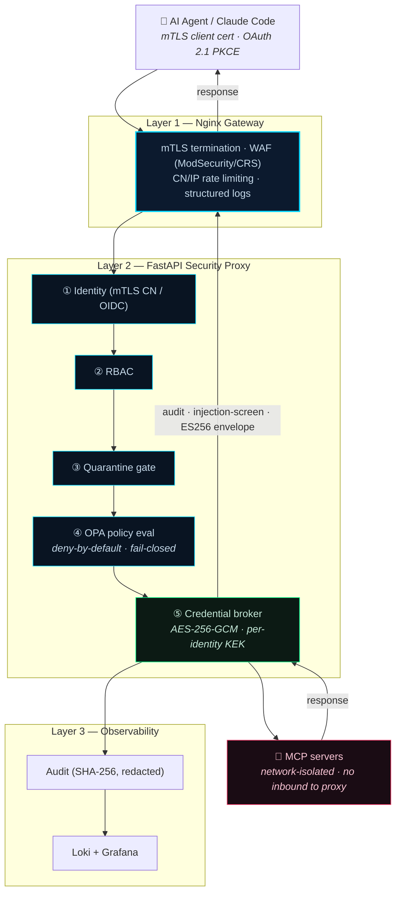

# MCP Security Platform

### Mediate, don't classify — a runtime security gateway for AI-agent tool calls.

> Every [Model Context Protocol](https://modelcontextprotocol.io/) (MCP) tool call passes through identity, policy, credential brokering, and audit — with backend MCP servers network-isolated by default.

[](https://github.com/webr0ck/mcp-security-platform/actions/workflows/ci.yml)
[](LICENSE)
[](docs/enforced-vs-roadmap.md)
[](https://www.python.org/)
[](https://www.openpolicyagent.org/)

---

## What is this for?

It lets you give LLM agents (Claude Code, Codex, …) real MCP tools — Jira, Grafana, a
GitHub server, your own — **without handing those tools the keys to your environment**.
Every tool call is mediated at runtime through **identity → policy → credential injection →
audit**, and the backend MCP servers are **network-isolated by default** so even a fully
hostile one never sees a raw credential, can't be called outside policy, and can't reach
anything else.

It's aimed at **platform and security engineers**, and it's an **open-source reference
implementation (work in progress)** — not a hardened product.

> **Engineering standard.** Every capability claim is matched to code, and every gap is
> tracked in the open — see **[Enforced today vs Roadmap](docs/enforced-vs-roadmap.md)**
> (the source of truth) and [`SECURITY.md`](SECURITY.md). An honest threat model is more
> useful than an over-claimed one.

**Jump to:** [Self-service](#the-main-focus-self-service-through-mcp) · [Thesis](#the-thesis) · [Design](#the-design) · [Enforced vs Roadmap](docs/enforced-vs-roadmap.md) · [Run it](#run-it) · [Connect Claude Code](#connect-claude-code) · [Docs](#documentation)

---

## The main focus: self-service through MCP

The centre of gravity is **self-service onboarding of MCP servers**, governed end to end:

1. **A server owner onboards a server** — `POST /api/v1/servers` (or the portal): give it a
   URL, the platform discovers its tools and **quarantines** them pending review.
2. **An admin approves** it (dual-control consent, adapter healthcheck, trust tier).
3. **A user calls its tools through the gateway** with **zero credentials in their client** —
   OAuth 2.1 PKCE end to end; the proxy injects the backend credential the client never sees;
   OPA decides every call; every call is audited.

Walk the full flow here:
- **[docs/user/self-service-onboarding.md](docs/user/self-service-onboarding.md)** — the user journey
- **[docs/mcp-server-onboarding.md](docs/mcp-server-onboarding.md)** — bringing your own MCP server
- **[docs/PROMPT_EXAMPLES.md](docs/PROMPT_EXAMPLES.md)** — real, tested prompts (check access, toggle a server, build + onboard one end to end)

---

## The thesis

You can't reliably decide *in advance* whether an MCP server is safe. Static scanning misses
**semantic capability** — a server that wraps a C2 framework, or quietly exfiltrates through a
"search" tool, looks benign until it calls home. So instead of classifying servers, this
platform **mediates every tool call** at runtime and keeps backends network-isolated.

**Threat model in one line:** the adversary is a *malicious or compromised MCP server* (or a
prompt-injected agent driving it) after credentials, data, or lateral movement — and the
platform's job is to make sure it gets none of them.

---

## The design

Three enforcement layers in front of network-isolated backends:



- **Layer 1 — Nginx gateway:** TLS/mTLS termination, ModSecurity/OWASP-CRS WAF, rate limiting.
- **Layer 2 — Security proxy:** identity → RBAC → quarantine → OPA/Rego (deny-by-default) → fail-closed credential injection → synchronous audit.
- **Layer 3 — Observability:** SHA-256 audit (raw args never persisted), Loki + Grafana, SIEM-ready stdout JSON.

**Go deeper:** [`docs/ARCHITECTURE.md`](docs/ARCHITECTURE.md) (canonical spec — enough to re-implement from scratch, incl. the security invariants) · [`docs/spec/`](docs/spec/README.md) (language-agnostic spec set + implementation lessons) · SIEM integration in [`docs/spec/05-integrations.md`](docs/spec/05-integrations.md).

---

## Enforced today vs Roadmap

The honest summary — full per-control detail (with code anchors) in **[docs/enforced-vs-roadmap.md](docs/enforced-vs-roadmap.md)**:

| Area | Enforced today | Roadmap |
|---|---|---|
| **Policy (OPA/Rego)** | Deny-by-default on REST + `/mcp`; signed bundles by default; discovery==invoke entitlement | unlinked tools governed by OPA only |
| **Identity** | mTLS + gateway-secret trust (fail-closed; prod requires the secret); PKCE enrollment | self-service cert issuance; prod `:443` mTLS split |
| **OIDC login** | Keycloak PKCE S256, session JWT, JTI revocation, Grafana SSO, RFC 9207 `iss` | some Bearer/`aud` dev-only fallbacks |
| **Credential broker** | wired at startup, fail-closed; HKDF KEK + AES-256-GCM + AAD row-binding | approach-B adapters orphaned |
| **Server registry** | DB source of truth; self-service onboarding + consent + quarantine; isolated `ops-agent` lifecycle | onboarding wizard UI; git-pull update |
| **Network isolation** | static topology gate across all tiers + host-port gate; CI runtime smoke | deeper red-team run on-demand |
| **Audit** | synchronous, SHA-256, args hashed only; Loki/Grafana | WORM archival; first-class syslog/CEF sink |
| **Trust envelope (POC)** | ES256-signed results, passive verifier, taint floor | federation; learned classifier |
| **SBOM / Anomaly** | CycloneDX; static advisory heuristic (labelled as such) | SPDX; learned baseline |

Remaining gaps are *coverage/wiring* gaps — tracked, not glossed.

---

## Run it

Two ways to run this, on **different container engines on purpose**:

| You want to… | Use | Engine | Guide |
|---|---|---|---|
| Production-shaped service, **bring your own** IDP / SIEM / MCP servers | `engine` tier | **Docker** Compose v2.20+ | **[INSTALL.md](INSTALL.md)** |
| The **full self-contained lab** (bundled Keycloak, Dex, Wazuh, sample servers) | lab stack | **Podman** 4.4+ | **[LAB.md](LAB.md)** |

```bash
git clone https://github.com/webr0ck/mcp-security-platform
cd mcp-security-platform
cp .env.lab.example .env.lab     # then set OIDC_ISSUER_URL (see LAB.md)
make -f Makefile.lab lab-up      # build + start + seed
make -f Makefile.lab lab-smoke   # expect all checks green
```

Reproducible demo of the verified **network-isolation** control:
`python scripts/check_network_isolation.py`. Test + security gates: [`docs/TESTING.md`](docs/TESTING.md).

---

## Connect Claude Code

Auth is **OAuth 2.1 PKCE via Keycloak — no static API keys.** Set `PROXY_BASE_URL` (your
machine's LAN/Tailscale IP) in `.env.lab`, then add the server on the client machine's
`~/.claude/settings.json`:

```json
{ "mcpServers": { "mcp-gateway": { "type": "http", "url": "http://<YOUR_LAN_IP>:8000/mcp" } } }
```

Use `"type": "http"` (not `"sse"`) and `"url"` (not `"command"`). On first connect the proxy
returns a 401 that drives OAuth discovery → dynamic client registration → browser login →
Bearer token — **no credentials in the config file**. Full walkthrough + troubleshooting:
[`docs/troubleshooting/oauth-client-connection.md`](docs/troubleshooting/oauth-client-connection.md).

---

## Documentation

| Doc | Purpose |
|---|---|
| [Enforced vs Roadmap](docs/enforced-vs-roadmap.md) | Authoritative per-control status |
| [`docs/ARCHITECTURE.md`](docs/ARCHITECTURE.md) | Canonical architecture spec + security invariants |
| [`docs/spec/`](docs/spec/README.md) | Language-agnostic re-implementation spec + lessons |
| [`docs/user/`](docs/user/self-service-onboarding.md) · [`docs/admin/`](docs/admin/rbac-and-grants.md) | User + admin guides (self-service, RBAC, provisioning) |
| [`docs/reference/`](docs/reference/auth-modes.md) · [`docs/runbooks/`](docs/runbooks/incident-triage.md) · [`docs/troubleshooting/`](docs/troubleshooting/onboarding.md) | Auth/injection modes, ops runbooks, troubleshooting |
| [`INSTALL.md`](INSTALL.md) · [`LAB.md`](LAB.md) | Production deploy · self-contained lab |
| [`SECURITY.md`](SECURITY.md) · [`CONTRIBUTING.md`](CONTRIBUTING.md) · [`AGENTS.md`](AGENTS.md) | Disclosure + known-limits · contributing · repo map |

### Technology

Nginx + ModSecurity · Python 3.12 / FastAPI / Pydantic v2 · OPA (Rego) · PostgreSQL 16 ·
Redis 7 · Keycloak (PKCE S256) + Dex · HashiCorp Vault · Smallstep step-ca · CycloneDX ·
Loki + Promtail + Grafana + Alertmanager + MinIO · Ollama (advisory risk scoring).

---

## License

[MIT](LICENSE) © 2026 Alexander Romanov

Built by [Alexander Romanov](https://purplehootie.com) — writing about runtime AI-agent security at [purplehootie.com](https://purplehootie.com).

> This is an independent open-source project and is **not affiliated with or endorsed by** Anthropic
> or the Model Context Protocol maintainers. "Model Context Protocol" and "MCP" refer to the open
> protocol at [modelcontextprotocol.io](https://modelcontextprotocol.io/).
